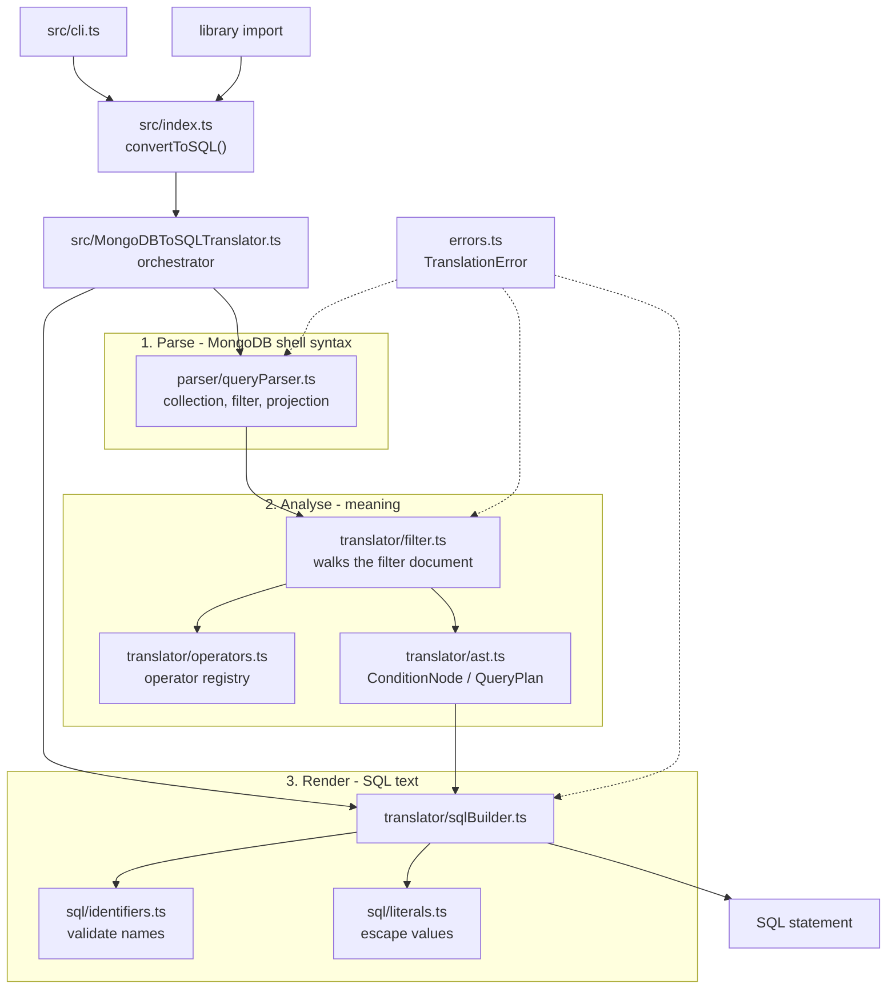
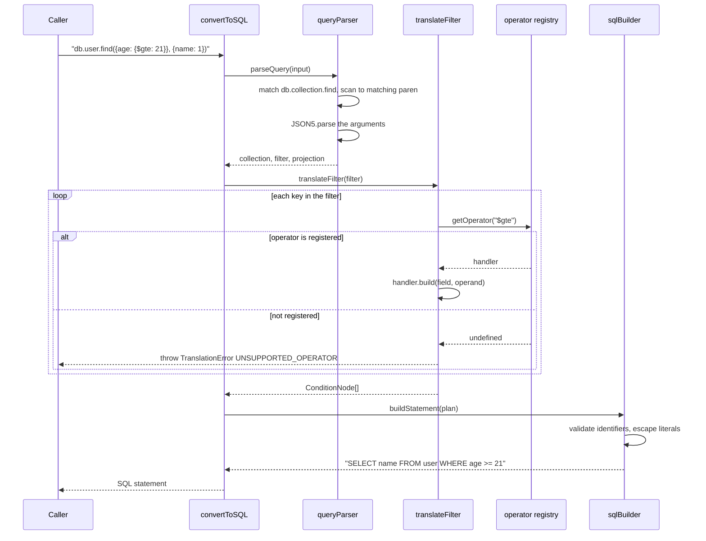

# MongoDB to SQL Translator

Translates a MongoDB `find()` query into the equivalent SQL `SELECT` statement.
It is a TypeScript library with a small CLI on top: you give it
`db.user.find({age: {$gte: 21}}, {name: 1})` and it gives you back
`SELECT name FROM user WHERE age >= 21;`.

Correctness is the whole product here, so the translator is deliberately
fail-closed: anything it cannot translate faithfully raises a `TranslationError`
rather than emitting best-effort SQL that would quietly return the wrong rows.

Originally written as a take-home exercise (Glassdoor). It stays scoped to that
brief — `find()` queries, no extra product features.

## Captured output

No UI — this is a library and a CLI. The transcripts below are literal output
from commands that were actually run; each file names the command that produced
it.

| File                                               | What it shows                                                                          |
| -------------------------------------------------- | -------------------------------------------------------------------------------------- |
| [`docs/cli-transcript.md`](docs/cli-transcript.md) | Real CLI runs: translations, and the inputs the translator refuses (with exit codes).  |
| [`docs/sql-execution.md`](docs/sql-execution.md)   | The generated SQL executed against a seeded SQLite database, with the rows it returns. |
| [`docs/benchmark.md`](docs/benchmark.md)           | Translation cost as the number of conditions in a filter grows.                        |

```console
$ node dist/cli.js --id "db.order.find({$and: [{status: 'placed'}, {total: {$gt: 100}}]}, {_id: 0, customer: 1})"
SELECT customer FROM order WHERE (status = 'placed' AND total > 100);
# exit 0

$ node dist/cli.js "db.user.find({name: {$exists: true}})"
error [UNSUPPORTED_OPERATOR]: Unsupported MongoDB operator "$exists". Supported: $and, $eq, $gt, $gte, $in, $lt, $lte, $ne, $or.
# exit 1
```

## Architecture

Three stages with one-way dependencies. The condition AST in the middle is the
only thing the SQL layer sees, so MongoDB syntax knowledge never reaches the SQL
writer and SQL dialect knowledge never reaches the parser.



## Workflow

What happens for one call, including the fail-closed path.



## Quickstart

```bash
npm install
npm run build
node dist/cli.js --id 'db.user.find({age: {$gte: 21}}, {name: 1, _id: 1})'
# SELECT name, id FROM user WHERE age >= 21;
```

Without building, via ts-node:

```bash
npm run dev -- "db.user.find({title: 'john'})"
```

As a library:

```typescript
import { convertToSQL, TranslationError } from 'mongodb-to-sql-translator';

try {
  const sql = convertToSQL('db.user.find({age: {$gte: 21}}, {name: 1})');
  console.log(sql); // SELECT name FROM user WHERE age >= 21;
} catch (error) {
  if (error instanceof TranslationError) {
    console.error(error.code, error.message);
  }
}
```

Pass `true` as the second argument to rewrite MongoDB's `_id` to the `id` column
name most relational schemas use:

```typescript
convertToSQL('db.user.find({_id: 23113}, {name: 1})', true);
// SELECT name FROM user WHERE id = 23113;
```

## Configuration

The translator is a pure function: it reads no configuration, opens no network
connection and touches no files, so there is nothing to configure with
environment variables.

| Variable   | Required | Default                                         | Purpose                                                                                                                                                                 |
| ---------- | -------- | ----------------------------------------------- | ----------------------------------------------------------------------------------------------------------------------------------------------------------------------- |
| `NODE_ENV` | No       | unset locally, `production` in the Docker image | Standard Node convention only. The translator's behaviour does not depend on it; it is set in the runtime image so transitive dependencies take their production paths. |

Behaviour is instead selected per call:

| Option                    | CLI                          | Library                           | Default | Purpose                                                  |
| ------------------------- | ---------------------------- | --------------------------------- | ------- | -------------------------------------------------------- |
| Rewrite `_id` to `id`     | `--id`                       | second argument to `convertToSQL` | `false` | Map MongoDB's primary key name onto the SQL column name. |
| Read the query from stdin | omit the positional argument | n/a                               | off     | Pipe queries in from another process.                    |

## Development

```bash
npm install         # install dependencies
npm test            # run the test suite
npm run test:coverage  # with coverage thresholds enforced
npm run typecheck   # tsc --noEmit
npm run lint        # eslint
npm run format:check  # prettier
npm run verify      # typecheck + lint + format + test, what CI should run
npm run bench       # translation throughput
npm run build       # emit dist/
```

One extra check worth knowing about:

```bash
npx ts-node scripts/verify-against-sqlite.ts   # run the generated SQL on a real database (needs the sqlite3 CLI)
```

Docker (the image is a CLI, not a service):

```bash
docker compose config                                            # validate
docker compose build
docker compose run --rm mongo2sql --id "db.user.find({_id: 1})"
```

## Project structure

```
src/
  index.ts                    Public API: convertToSQL, plus the types callers need
  cli.ts                      Thin CLI wrapper; argument handling and exit codes only
  MongoDBToSQLTranslator.ts   Orchestrator: parse -> analyse -> render
  errors.ts                   TranslationError and its error codes
  parser/
    queryParser.ts            db.<collection>.find(...) -> collection, filter, projection
  translator/
    ast.ts                    ConditionNode / QueryPlan: the MongoDB-free, SQL-free middle
    operators.ts              Operator registry - the extension point
    filter.ts                 Walks a filter document into ConditionNode[]
    sqlBuilder.ts             ConditionNode[] -> SQL text
  sql/
    identifiers.ts            Validates collection and field names
    literals.ts               Escapes and renders values
__tests__/
  index.test.ts               The exercise's original acceptance cases, kept verbatim
  translation-table.test.ts   Input -> expected SQL reference table
  rejections.test.ts          Every input that must be refused, and with which code
  security.test.ts            SQL injection attempts through query values
  registry.test.ts            Adding an operator without touching the pipeline
  cli.test.ts                 Streams and exit codes
scripts/
  benchmark.ts                Translation cost vs number of conditions
  verify-against-sqlite.ts    Executes the generated SQL against a seeded database
docs/                         Captured output referenced from this README
```

## Design notes

**Three stages, one-way dependencies.** Parsing, analysis and rendering are
separate modules joined by an explicit AST (`translator/ast.ts`). That boundary
is what makes the rest of the design possible: the SQL builder can be changed
for a different dialect without knowing MongoDB exists, and the parser can be
changed without knowing SQL exists.

**Fail closed.** The earlier version logged errors to the console and then
carried on, so `db.user.insert({a: 1})` printed "not supported" and still
returned `SELECT * FROM user WHERE a = 1;`. Unmapped operators were interpolated
as the literal string `undefined`. Both are the same failure mode - a wrong
answer that looks like success - and for a translator that is worse than an
exception. Every refusal now throws a `TranslationError` carrying a code
(`UNSUPPORTED_OPERATOR`, `INVALID_IDENTIFIER`, ...) so callers can branch on the
reason. `rejections.test.ts` pins one case per code.

**Values are escaped, identifiers are validated.** These are different problems
and get different solutions. Values become single-quoted literals with `'`
doubled, in exactly one function (`sql/literals.ts`); a value can therefore
contain `'; DROP TABLE users; --` and stay inert data (see
`docs/sql-execution.md`, which runs that payload against a live database and
shows the table still standing). Identifiers cannot be escaped that way without
picking a quoting dialect, so they are instead validated against a strict
pattern and rejected if they do not match - an attacker-controlled field name
never reaches the output at all.

**Null is not a value.** SQL has no `= NULL`, so `{name: null}` becomes
`name IS NULL` and `{name: {$ne: null}}` becomes `name IS NOT NULL`. Similarly
`{$in: []}` matches nothing in MongoDB and `IN ()` is a syntax error, so it
renders as `1 = 0`.

**Groups are always parenthesised.** `$and`/`$or` render their own brackets
rather than relying on the target dialect's operator precedence, so
`{a: 1, $or: [{b: 2}, {c: 3}]}` is unambiguous: `a = 1 AND (b = 2 OR c = 3)`.

**The operator registry is the extension seam.** Supporting a new operator is
one `OperatorHandler` and one `registerOperator` call; the parser, the filter
walker and the SQL builder do not change. `registry.test.ts` demonstrates this
by adding `$nin` at runtime. This is the one seam the project needs, which is
why there are not five others.

**Scalability.** There is no database, queue or network here, so the only input
that grows without bound is the number of conditions in a single filter. The
previous implementation accumulated results with
`reduce((prev, curr) => [...prev, curr], [])` in five places, which is quadratic;
measured, a tenfold increase in size cost 81x the time. Translation is now
linear at roughly 2 microseconds per condition, flat from 100 to 10,000
conditions. Numbers and method are in [`docs/benchmark.md`](docs/benchmark.md).
The `mongo-parse` dependency was also dropped - the filter walk is forty lines
of code, and owning it is what makes strict operator rejection possible.

**Tests are the specification.** `translation-table.test.ts` is a table of input
query to exact expected SQL, covering operator coverage, nesting and precedence,
null handling, numeric versus string literals, quoting, dotted paths and empty
filters. `docs/sql-execution.md` closes the loop by executing that generated SQL
on a real SQLite database, because a string comparison alone cannot tell you the
statement is valid SQL.

## Limitations

Known and deliberate. The translator refuses each of these with a clear error
rather than guessing.

- **Only `find()`.** No `insert`, `update`, `aggregate`, `count` or `distinct`.
- **No cursor methods.** `.limit()`, `.skip()` and `.sort()` are rejected;
  `LIMIT`/`OFFSET`/`ORDER BY` are not generated.
- **Supported operators are `$and`, `$or`, `$eq`, `$ne`, `$gt`, `$gte`, `$lt`,
  `$lte`, `$in`.** Everything else - `$nin`, `$nor`, `$not`, `$exists`,
  `$regex`, `$expr`, `$elemMatch`, the array and geo operators - is rejected.
  Adding one is a registry entry (see Design notes), but nothing is claimed to
  work that has not been tested.
- **Identifiers are emitted unquoted.** A collection or column whose name is a
  SQL reserved word (`order`, `user`, `select`) produces SQL that some engines
  reject. Quoting would mean committing to a dialect; this translator does not.
- **Nested paths are emitted verbatim.** `{'address.city': 'NY'}` becomes
  `address.city = 'NY'`, which SQL reads as _table_._column_. Whether that is
  what you want depends on how the document was flattened into tables.
- **No joins, no schema knowledge.** One collection maps to one table of the
  same name. There is no `$lookup` support and no awareness of column types.
- **Projections are inclusion-only.** Keys set to `1` become the select list;
  keys set to `0` are ignored, so a pure-exclusion projection yields `SELECT *`
  rather than "all columns except these".
- **No dialect switch.** Output targets common ANSI SQL and is verified against
  SQLite. Booleans render as `TRUE`/`FALSE` and inequality as `!=`, which suits
  PostgreSQL, MySQL and SQLite but not every engine.

## License

ISC.
